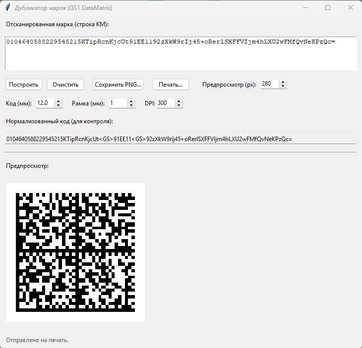

# Дубликатор марок (Python + Zint)

Небольшое приложение(скрипт), которое принимает строку КМ, нормализует её и строит GS1 DataMatrix для повторной печати.
Копирование (создания дубликата) qr-кодов (DataMatrix) для их нанесения на потребительскую упаковку и на упаковку для маркетплейсов с помощью сканера.



## Требования

- Python 3.10+
- Установленный `zint` (утилита генерации штрихкодов, проект: `https://github.com/zint/zint`)
  - Windows: установить Zint и добавить `zint.exe` в `PATH` (либо положить `zint.exe` рядом с `app.py`, либо задать переменную `ZINT_PATH`)
  - Ubuntu: `sudo apt install zint`

## Установка зависимостей Python

```bash
pip install -r requirements.txt
```

## Запуск

```bash
python app.py
```

## Формат входной строки

Поддержаны форматы:

`01<GTIN14>21<SN(6)>93<CHECK(4)>`

Приложение автоматически вставит разделитель GS (ASCII 29) между `21` и `93` и передаст данные в Zint в режиме GS1.

Также поддержан вариант, когда после `21` идут дополнительные AI, разделённые GS (как на сканерах/терминалах):

`01<GTIN14>21<SN><GS>91<...><GS>92<...>`

